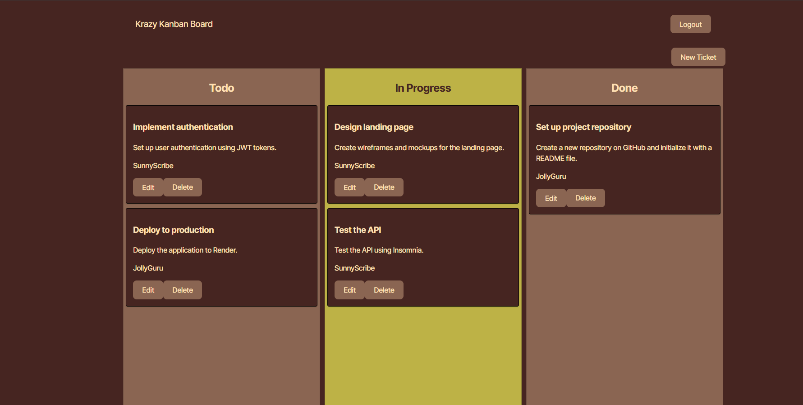

# 14-Challenge-JSON-Web-Tokens
## Description
AS A member of an agile team I WANT a Kanban board with a secure login page SO THAT I can securely access and manage my work tasks 

## Installation

No installation is needed

## Usage

The first thing you will need to do is log-in with one of the three users: JollyGuru, SunnyScribe, or RadiantComet, the password for all three is "password". After that you use it like a standard Kanban board, you can add, edit, or delete tasks on the board.

*This is a screenshot of the Kanban board.*

[Link to App](https://one4-challenge-json-web-tokens.onrender.com/)
